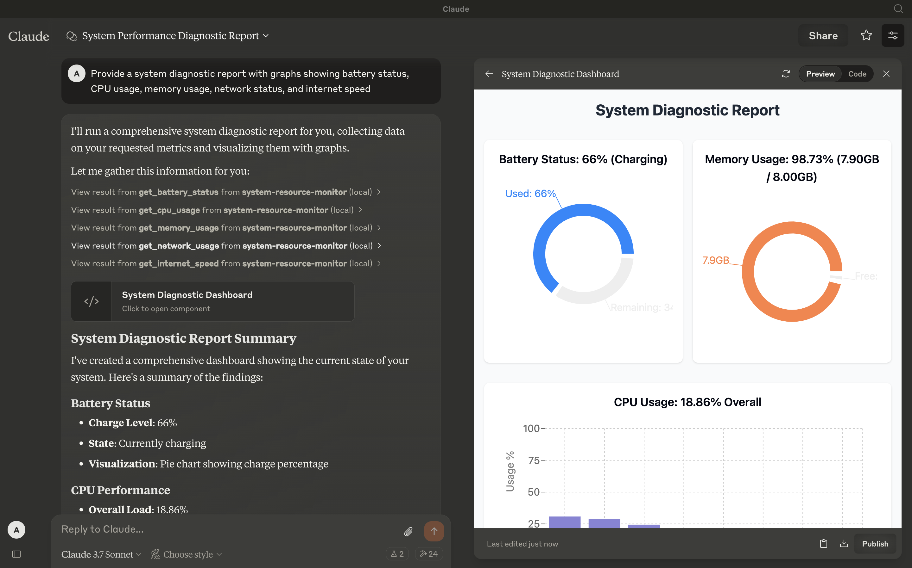
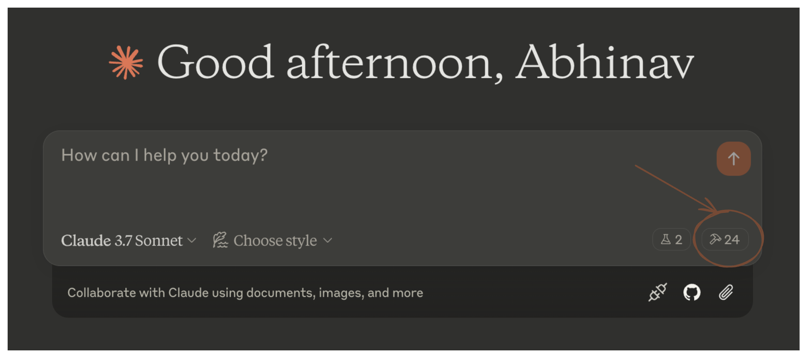
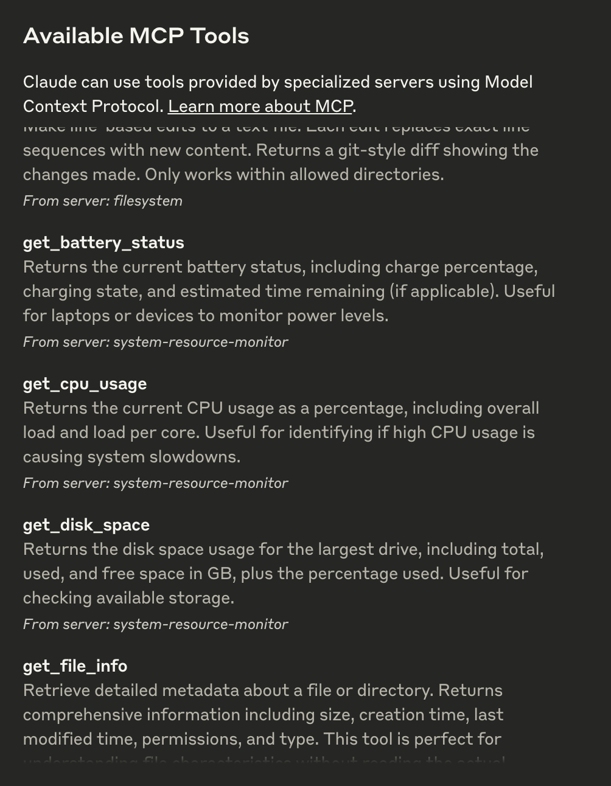

# System Resource Monitor MCP Server

An MCP server that provides Claude with real-time system monitoring capabilities, including CPU, memory, disk, network, battery, and internet speed metrics using `systeminformation` and multi-source speed tests.

  

## Tools

- **get_cpu_usage**
  - Retrieves the current CPU load as a percentage, including overall and per-core usage.
  - **Inputs**: None
  - **Output**: Text (e.g., `CPU Load: 12.34% (Cores: 10.50, 15.20, 8.90, 14.60%)`)

- **get_memory_usage**
  - Reports total, used, and free memory in GB, plus percentage used.
  - **Inputs**: None
  - **Output**: Text (e.g., `Memory: 65.43% used (7.82GB / 16.00GB)`)

- **get_disk_space**
  - Shows disk usage for the largest drive in GB and percentage.
  - **Inputs**: None
  - **Output**: Text (e.g., `Disk (/): 78.90% used (189.50GB / 250.00GB)`)

- **get_network_usage**
  - Returns real-time network RX/TX rates (KB/s) and total data since boot (MB).
  - **Inputs**: None
  - **Output**: Text (e.g., `Network (eth0): RX: 25.50KB/s, TX: 10.20KB/s (Total: RX 150.34MB, TX 75.89MB)`)

- **get_battery_status**
  - Provides battery charge percentage, charging status, and time remaining (if applicable).
  - **Inputs**: None
  - **Output**: Text (e.g., `Battery: 85% (charging), 120 min remaining` or `No battery detected`)

- **get_internet_speed**
  - Measures internet speed using multiple download sources (including a user-uploaded file) and upload tests, returning median speeds in Mbps.
  - **Inputs**: None
  - **Output**: Text (e.g., `Internet Speed: Download 45.67Mbps, Upload 8.45Mbps`)

## Configuration

### Step 1: Clone and Install

Clone this repository:

```bash
git clone git@github.com:abhinav7895/mcp-system-resource-monitor.git
```

Navigate to the directory and install dependencies:

```bash
cd system-resource-monitor && npm install
```

### Step 2: Build the Project

Compile the TypeScript code:

```bash
npm run build
```

This generates the `dist/index.js` file, ready to run as an MCP server.

### Step 3: Configure Claude Desktop

1. Download Claude Desktop [here](https://claude.ai/download).
2. Add this to your `claude_desktop_config.json`:

```json
{
  "mcpServers": {
    "system-resource-monitor": {
      "command": "node",
      "args": ["/absolute/path/to/dist/index.js"]
    }
  }
}
```

Access the config file:

```bash
vim ~/Library/Application\ Support/Claude/claude_desktop_config.json
```

*(Adjust the path to `dist/index.js` based on your project location.)*


### Step 4: Testing

Ensure Claude Desktop recognizes the tools by checking for the hammer icon:



Click the hammer icon to see available tools:



If all six tools (`get_cpu_usage`, `get_memory_usage`, etc.) appear, the integration is active. You can now ask questions like:
- "What’s my CPU usage?"
- "How fast is my internet?"

### Step 5: Advanced Customization

- **Internet Speed Test**: Modify `testUrls` in `index.ts` to use different download sources or adjust `uploadSizeBytes` (default 80KB) for upload tests.
- **Logging**: Console logs provide detailed test output; disable them in production by removing `console.log` statements.

### Troubleshooting

- **Tool Not Showing**: Verify the server is running (`node dist/index.js`) and the config path is correct.
- **Internet Speed Errors**: Ensure network connectivity and test URLs are accessible. Check console logs for specific failures.
- Refer to the [MCP troubleshooting guide](https://modelcontextprotocol.io/docs/tools/debugging)

## License

This MCP server is licensed under the MIT License. You are free to use, modify, and distribute the software under the terms of the MIT License. See the `LICENSE` file for details.
